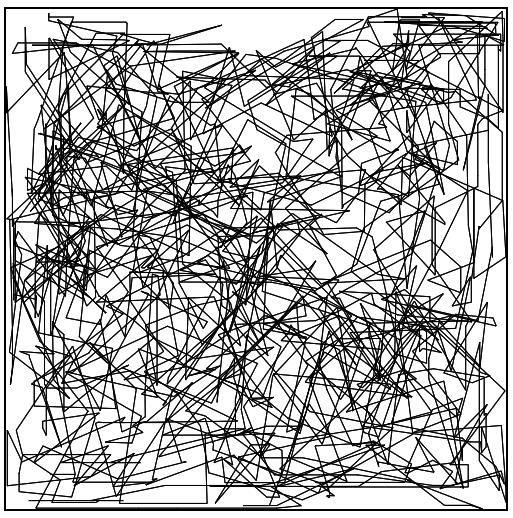

# js-canvas-picasso

Hi there! 

I created this project to try to generate automatic drawing by vectors and trigonometry. In the preview image below, you can see what a working picasso looks like after opening the src/picasso.html file.  

Feel free to use my code and modify it as you see fit if you want!

---
|||
|-|-|
| Author: | Filip Janoušek |
| Alias: | Saburo Toshiro |
| Time: | ~ 3 hours |

